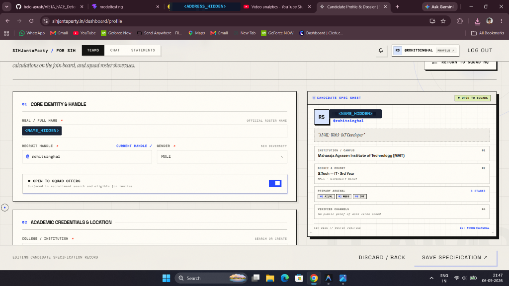
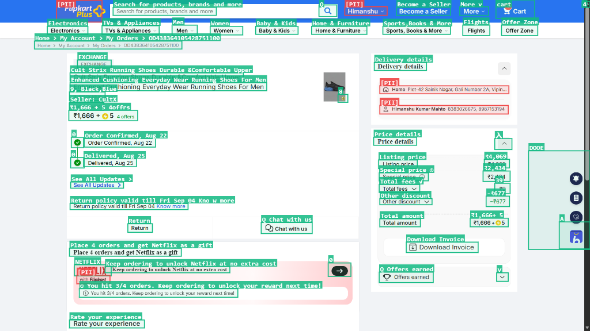
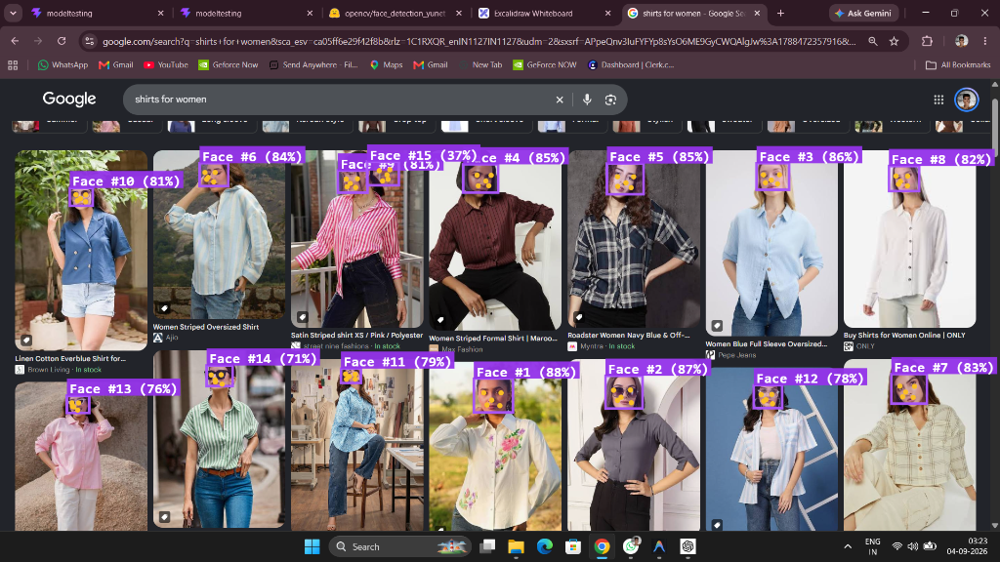
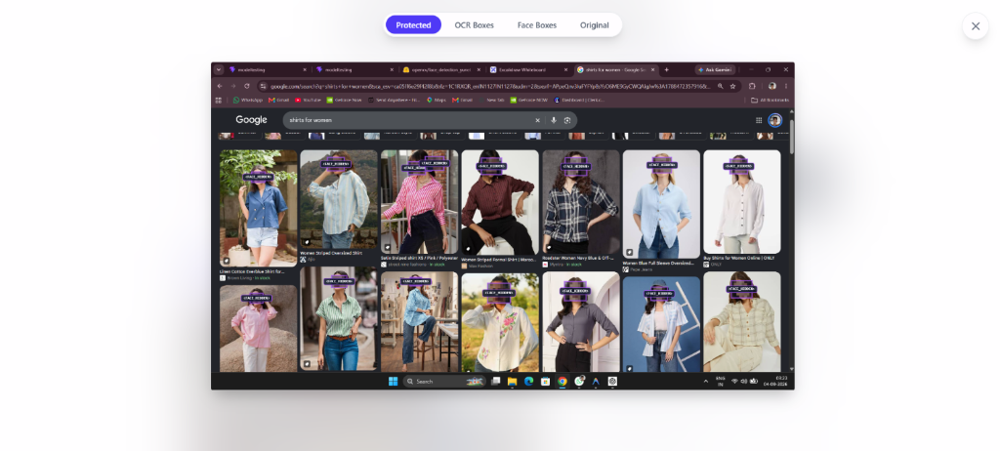

# VISTA — 100% On-Device Screenshot Privacy Redactor

> **Zero-Server Client-Side Privacy Engine**  
> Automatically detect faces, extract text with sub-second OCR, identify sensitive PII (names, handles, addresses, IDs), and apply guided semantic privacy blurs — **100% in-browser via WebAssembly**.

---

## Visual Walkthrough & Screenshots

### 1. Candidate Profile & Social Handle Masking
*Automatically identifies full names, candidate identifiers, and social handles (`@username`), replacing them with machine-readable guided semantic tokens.*



---

### 2. High-Accuracy Document Text Scanning & PII Isolation
*Scans dense documents (order confirmations, delivery addresses, phone numbers, prices) with zero word drops and marks sensitive personal data in red.*



---

### 3. Multi-Face Detection on Dense Photo Galleries
*Processes complex multi-model photo grids, detecting 15+ faces with 5 facial landmarks while suppressing fabric and clothing texture noise.*



---

### 4. Minimalist Translucent Lightbox with Pan & Zoom
*Click anywhere on the processed document to inspect tiny text, OCR boxes, or redaction masks with smooth mouse-wheel zooming, drag-to-pan, and instant mode switching.*



---

## Core Philosophy: Why 100% Client-Side?

Most privacy masking tools send user images to a remote cloud server or third-party LLM API. **This defeats the purpose of privacy.**

With **VISTA**:
* **Zero Cloud Uploads:** No bytes ever leave the user's browser. Everything runs locally on the client's CPU via WebAssembly SIMD.
* **Completely Offline Capable:** Once loaded, all neural models (`.onnx`, `.ort`) and tokenizers run with `local_files_only: true` and zero network requests.
* **Guided Semantic Redaction:** Unlike destructive black bars that blind downstream AI systems, VISTA overlays machine-readable tokens like `<NAME_HIDDEN>`, `<FACE_HIDDEN>`, `<HANDLE_HIDDEN>`, and `<ADDRESS_HIDDEN>`. Downstream LLMs and vision agents understand *what* was masked without exposing the underlying personal data.

---

## The 4-Level Pipeline Architecture

```
                                  [ Upload Screenshot ]
                                             │
                                             ▼
                     ┌───────────────────────────────────────────────┐
                     │          Level 1: Face Detection              │
                     │          OpenCV YuNet ONNX (~232 KB)          │
                     │  • 640×640 single-pass FPN anchor decoder     │
                     │  • 5 facial landmarks + IoU NMS (60–90 ms)    │
                     └───────────────────────┬───────────────────────┘
                                             │
                                             ▼
                     ┌───────────────────────────────────────────────┐
                     │          Level 2: Document OCR                │
                     │       PaddleOCR v6 Tiny (1.8MB + 4.5MB)       │
                     │  • Stage 1: DBNet text box detection          │
                     │  • Stage 2: SVTR CTC text recognition         │
                     │  • Per-box width-sorted SIMD batching         │
                     └───────────────────────┬───────────────────────┘
                                             │
                                             ▼
                     ┌───────────────────────────────────────────────┐
                     │          Level 3: Hybrid PII Engine           │
                     │    Xenova BERT-NER + Deterministic Regex      │
                     │  • Transformers.js token classification       │
                     │  • 22+ Indian & Global deterministic patterns │
                     │  • Handles (@username), Syntactic Addresses   │
                     └───────────────────────┬───────────────────────┘
                                             │
                                             ▼
                     ┌───────────────────────────────────────────────┐
                     │       Level 4: Guided Semantic Redaction      │
                     │            HTML5 Canvas + Lightbox            │
                     │  • Privacy pixelation + frosted dark fill     │
                     │  • <TAG_HIDDEN> high-contrast vector badges   │
                     │  • Real-time Pan & Zoom inspection lightbox   │
                     └───────────────────────────────────────────────┘
```

---

## Detailed Component & Model Breakdown

### Level 1: Face Detection (OpenCV YuNet)
* **Model File:** [`public/models/face/face_detection_yunet_2023mar.onnx`](public/models/face/face_detection_yunet_2023mar.onnx) (~232 KB)
* **Runtime:** `onnxruntime-web` (WebAssembly execution provider).
* **Architecture:** Lightweight Single-Stage Feature Pyramid Network (FPN) operating over strides 8, 16, and 32.
* **Outputs:** 12 raw tensors decoded into bounding boxes (`x`, `y`, `w`, `h`), confidence scores, and 5 facial landmarks (eyes, nose, mouth corners) with Non-Maximum Suppression (IoU: 0.3).
* **Latency:** **~60–90 ms** on standard CPU.

---

### Level 2: Document OCR (PP-OCRv6 Tiny)
* **Detection Model:** [`public/models/paddle/PP-OCRv6_tiny_det.ort`](public/models/paddle/PP-OCRv6_tiny_det.ort) (1.88 MB)
* **Recognition Model:** [`public/models/paddle/PP-OCRv6_tiny_rec.ort`](public/models/paddle/PP-OCRv6_tiny_rec.ort) (4.53 MB)
* **Dictionary:** [`public/models/paddle/ppocrv6_tiny_dict.txt`](public/models/paddle/ppocrv6_tiny_dict.txt) (27 KB)
* **Why PP-OCRv6 Tiny?**
  * In-browser OCR is a 2-stage pipeline: detection scans the image, and recognition evaluates *each* detected text crop.
  * In benchmarks on browser CPU WebAssembly, **PP-OCRv6 Tiny is 3.4x faster** than PP-OCRv6 Small (31.6 ms vs 108.2 ms per batch of 8), avoiding memory stalls and thread contention.
* **Engine Optimizations:**
  * `strategy: 'per-box'`: Eliminates heavy DOM canvas merging and position-splitting math.
  * `maxSideLength: 960`: Downsamples 1080p screenshots by 55% for DBNet without losing character fidelity.
  * `recBatchSize: 8`: Groups crops of similar width together, cutting zero-padding computation by ~85%.
  * `paddingHorizontal: 0.8`: Extra margin ensures boundary letters (`s`, `m`, `d`) are never clipped.
* **Latency:** **~400–700 ms** for typical screenshots.

---

### Level 3: Hybrid PII & Address Detection Engine
Combines deep semantic NER with deterministic rule-based pattern matching:

1. **Local Semantic BERT-NER:**
   * Model: `Xenova/bert-base-multilingual-cased-ner-hrl` quantized ONNX running 100% offline via `@huggingface/transformers`.
   * Classifies person names (`PER`) and geographical locations (`LOC`).
2. **Social Handles & Usernames:**
   * Catches `@username`, `@ rohitsinghal`, and labeled IDs (`ID: #ROHITSINGHAL`, `Recruit Handle: rohit`).
   * Output Tag: `<HANDLE_HIDDEN>`.
3. **Deterministic Global & Indian PII Rules:**
   * **Government & National IDs:** Aadhaar (12-digit & masked `XXXX-XXXX-1234`), PAN Card (`ABCDE1234F`), Voter ID (EPIC), Indian Driving License, Passport Numbers (Indian & Global), US SSN / ITIN, UK NINO, Belgian BIS.
   * **Financial:** Credit/Debit Cards (Visa, Mastercard, Amex, RuPay), Bank Account Numbers, Indian IFSC Codes, Indian GSTIN, TAN, UPI IDs / VPAs (`user@okaxis`, `user@paytm`, etc.), International IBANs.
   * **Contact & Communication:** Phone Numbers (Indian mobile `+91`, Indian landlines with STD codes, US/International formats), Email Addresses, Personal URLs.
   * **Syntactic Indian Address Engine:** Multilingual locality keywords (`Plot-`, `Gali No.`, `Nagar`, `Colony`, `Sector`, `Apartments`, `Vihar`, `Layout`, `Chowk`, PIN codes, Indian States).
4. **False-Positive Shields:**
   * Comprehensive UI stopword filter (discards "Cart", "Home", "Download", "Search", "Price", "Return", etc.).
   * Fashion & Corporate Brand filter (`COMPANY_INDICATORS` for "Pepe Jeans", "Zara", "CultX", "Flipkart", "Pvt Ltd", etc.).
* **Latency:** **~60–120 ms**.

---

### Level 4: Guided Visual Redaction & Zoom Lightbox
* **Canvas Engine:** Draws directly to an offscreen HTML5 `<canvas>` using high-contrast vector typography and pixelation blur.
* **Interactive Lightbox:**
  * Translucent blurred glass background (`backdrop-blur-2xl`).
  * Floating top mode pills (`Protected`, `OCR Boxes`, `Face Boxes`, `Original`) that switch **instantaneously with zero lag**.
  * Smooth mouse-wheel zoom (20% to 600%) and click-and-drag panning.
  * Double-click magnification toggle.

---

### Level 5: On-Device Model Management & Storage Reclamation
* **Live Download Progress Pill:** When deployed to production, first-time users receive real-time streaming feedback with exact percentages and MB loaded (`Downloading Models: 45% (52.8 MB)`).
* **Browser Cache API Persistence:** Model weights are stored locally in the client's `CacheStorage`. Subsequent visits and scans run completely offline with 0 ms network overhead.
* **One-Click Space Reclamation:** A prominent `Clear Space` button allows users to immediately purge cached neural weights (`~118 MB`) from Cache API, IndexedDB, and memory, returning origin storage usage back to `0 MB`.

---

## Benchmark Comparison on Client CPU

Tested on an Intel Core i5/i7 consumer laptop running Chrome:

| Pipeline Stage | Model | Model Size | Execution Provider | Latency |
| :--- | :--- | :--- | :--- | :--- |
| **Level 1: Face** | OpenCV YuNet | 232 KB | WASM | **60 – 95 ms** |
| **Level 2: OCR (Det)** | PP-OCRv6 Tiny Det | 1.88 MB | WASM SIMD | **69 ms** |
| **Level 2: OCR (Rec)** | PP-OCRv6 Tiny Rec | 4.53 MB | WASM SIMD | **31.6 ms / batch** (~350–550 ms total) |
| **Level 3: PII (BERT)** | Xenova BERT-NER | 103 MB (LFS) | WASM | **70 – 110 ms** |
| **Level 3: PII (Regex)**| VISTA Regex Suite | — | JavaScript | **< 2 ms** |
| **Level 4: Redaction** | HTML5 Canvas | — | Canvas2D | **1 – 2 ms** |
| **Total Pipeline** | **End-to-End** | **~110 MB** | **100% In-Browser** | **~800 – 1,200 ms** |

---

## Tech Stack

* **Frontend:** [React 19](https://react.dev/), [Vite](https://vitejs.dev/)
* **Styling:** [Tailwind CSS v4](https://tailwindcss.com/)
* **Inference Engine:** [ONNX Runtime Web](https://onnxruntime.ai/docs/tutorials/web/) (`onnxruntime-web`), [@huggingface/transformers](https://huggingface.co/docs/transformers.js)
* **OCR Library:** [`ppu-paddle-ocr`](https://www.npmjs.com/package/ppu-paddle-ocr)

---

## Getting Started Locally

### 1. Clone Repository
```bash
git clone https://github.com/helo-ayush/VISTA.git
cd VISTA
```

### 2. Install Dependencies
```bash
npm install
```

### 3. Start Development Server
```bash
npm run dev
```

Open `http://localhost:5173/` (or port specified in terminal) in your browser.

### 4. Build for Production
```bash
npm run build
```

---

## Privacy & Security Guarantee

VISTA is designed with a strict zero-trust security model:
* **No network requests** are dispatched when processing images.
* **No image data or extracted text** is saved to external storage or databases.
* Closing the browser tab immediately wipes all memory structures.
